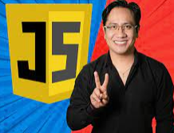

# Universidad JavaScript 2021 - De Cero a Experto JavaScript!

## Descripcion 

Curso tomado en la platafoma Udemy

https://www.udemy.com/course/universidad-javascript-angular-react-vue-typescript-html-css-bootstrap/

Programación Orientada a Objetos, Funciones Flecha, Callback, Promesas, Async, Await, DOM y más! 

El curso es impartido por Ubaldo Acosta

## Galeria

## Lo que se aprendera 

- Convertirse de un total principiante a un desarrollador avanzado de JavaScript
- Fundamentos de JavaScript y programación: variables, lógica booleana, if / else, bucles, funciones, matrices, etc.
- Una verdadera comprensión de cómo funciona JavaScript a detalle.
- Practica tus nuevas habilidades con los desafíos de codificación (soluciones incluidas)
- Codificar varias aplicaciones hermosas del mundo real con JavaScript
- Nuevas caraterísticas en JavaScript: Funciones de flecha, Clases, Funciones Callback, Promesas, Async/Await, etc.
- Organiza y estructura tu código usando las mejores prácticas de JavaScript
- Código descargable y recursos de diseño para todos los proyectos.